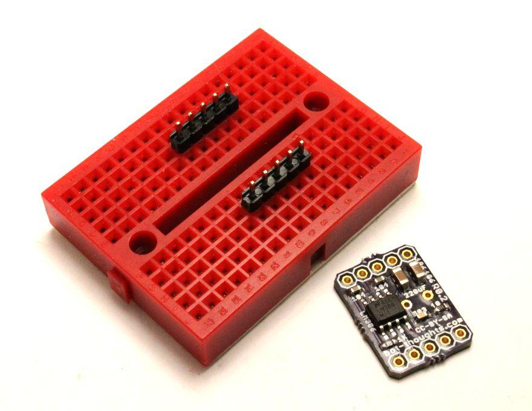
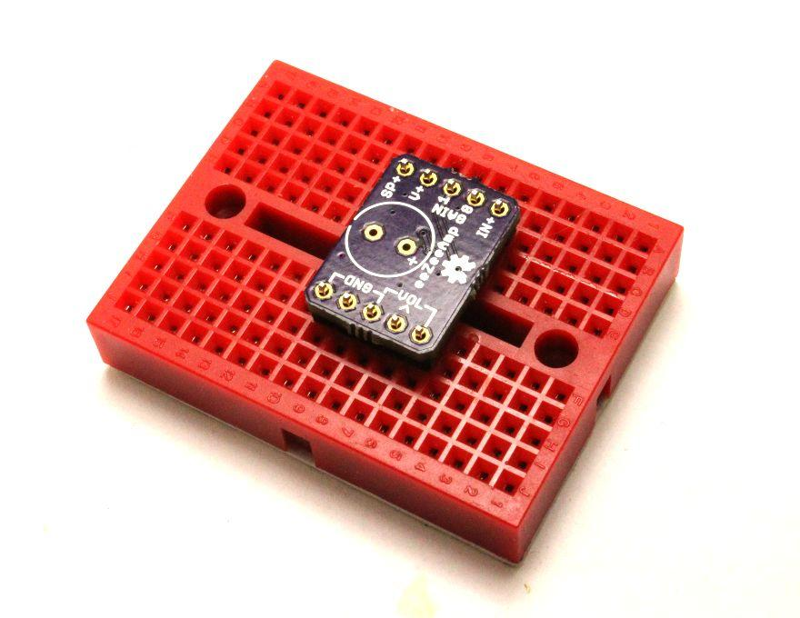
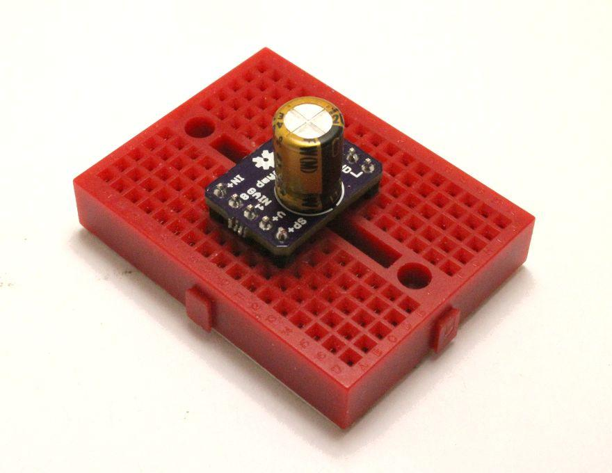

# eeZeeAmp User Guide

Add clean audio amplification to your next project with eeZeeAmp, the breadboard friendly, super-compact, amplifier board based on the popular LM386.

Want one? [Buy now on Tindie](https://www.tindie.com/products/bot_thoughts/the-better-lm386-for-breadboard/).

## Quick Start

 * Install pin headers (see *How to Assemble* below)
 * Install 200uF output capacitor (**note polarity!**)
 * Connect speaker to ```SP+``` and ```GND```
 * Connect potentiometer to the 3 ```VOL``` pins
 * Connect audio input positive to ```IN+```, negative to ```GND```
 * Connect 4-12V positive to ```V+```, negative to ```GND```

## Introduction
If you've ever created a project that generates sound, you'll appreciate eeZeeAmp, which makes it convenient and easy to add an audio amplifier to your breadboard. It's extremely compact, clearly labeled, and is simple and convenient to use.

The board is based on an LM386 audio amplifier and provides breakout pins for volume, gain, input, output, and power as well as supporting circuitry: capacitively-coupled input, volume circuit, bypass capacitors, AC-coupled audio-grade output capacitor, and high pass filter.

## About the LM386
The LM386 is a popular, low-voltage, low-distortion audio power amplifier with configurable gain from 20X-200X. It uses ground-referenced inputs and the output is conveniently biased to half the supply voltage.

The chip's quiescent power drain is 24mW at 6V. Low distortion of 0.2% THD (Gain = 20, Vin = 6V, Rload = 8Ω, PO = 125mW, f = 1kHz).

Power supply rejection ratio (PSRR) of 50dB referred to output (Vin = 6V, f = 1 kHz, pins 1 and 8 open, and with bypass capacitor of 10uF pre-installed on the board).

Datasheet: [lm386.pdf](http://www.ti.com/lit/ds/symlink/lm386.pdf)

## Power Supply
Supply 4-12V of power to the board. Connect the positive side of your supply to ```V+``` and the negative supply to one of the three ```GND``` pins.

## Speaker
You can use an 4-16Ω speaker for output, but you'll get more power output with less power dissipation using an 8-16Ω speaker.

## Audio Input
Connect the positive audio signal

## Potentiometer
A 10k potentiometer will work best. Connect the wiper of the potentiometer (pot) to the ```> VOL``` pin and connect the other two pot leads to the ```VOL``` pins.

### Linear Taper
A linear taper potentiometer has a resistance that varies linearly with wiper position. While it works reasonably well with the LM386, our hearing isn't linear in its sensitivity.

### Audio Taper
An audio taper pot has a resistance that varies non-linearly to match our hearing. To our ears, such a pot produces *loudness* that appears to vary linearly with wiper position.

## Setting Gain
By default, with no external components, gain factor is set to 20 (26 dB).
For a gain of 200, connect a 10uF capacitor between pins 1 and 8.

To select a gain between 20 (26 dB) and 200 (46 dB), place a resistor in series with the capacitor between pins 1 and 8. Use the table below to select the appropriate resistor value to achieve the desired gain.

For adjustable gain, you can use a 10k potentiometer instead of the fixed resistor. Or, you can capacitively couple a resistor or FET from pin 1 to ground.

| Desired Gain | Closest Resistor (Ω) | True Gain Factor | True Gain (dB) |
| :---: | :---: | :---: | :---: |
| 200 | none | 200.0 | 46.0 |
| 100 | 160 | 102.4 | 40.2 |
| 80 | 270 | 80.0 | 38.1 |
| 70 | 330 | 37.2 | 37.2 |
| 60 | 470 | 60.2 | 35.6 |
| 50 | 680 | 49.8 | 33.9 |
| 40 | 1000 | 41.4 | 32.3 |
| 30 | 2200 | 30.4 | 29.7 |
| 20 | 100k | 20.2 | 26.1 |

## How to Assemble

Assembly is easy. And, you can learn how to solder at the same time. Review [Sparkfun's Soldering Tutorial](https://learn.sparkfun.com/tutorials/how-to-solder---through-hole-soldering) if you need to. Here's a helpful info-graphic from the tutorial:


## You'll need
* Soldering iron, 40W
* Sponge to clean the iron (I recommend a brass sponge)
* Workbench with plenty of light
* Ventilation since breathing flux fumes is irritating
* Soldering surface (e.g., marble tile sample)
* Rosin core solder 0.022” or 0.032” diameter
* Kester #2331-ZX flux pen (optional)

## Pin headers
Apply flux to the outer pin header pads on the board.

Insert the two 5-pin headers into a breadboard 0.7” apart (6 rows between).



Install the eeZeeAmp board on the pin headers.



Solder one pin on each side, then continue soldering the remaining pins.

## 220uF Capacitor
Note that the footprint for the 220uF capacitor is on the top of the board and the positive terminal is labeled with a “+” symbol. The black stripe on the capacitor indicates the negative terminal (see right)



Insert the 220uF output capacitor into the board with the black stripe (negative terminal) closest to the board edge.

While holding the capacitor and board together, solder the positive terminal.

Then, solder the negative terminal. Because it is connected to a large ground plane, it may take longer to heat up the pad and melt the solder.

## Cleanup

You'll want to remove the rosin and flux

I usually just use isopropyl alcohol and an old toothbrush

You can also buy chemicals specifically for removing flux and rosin


